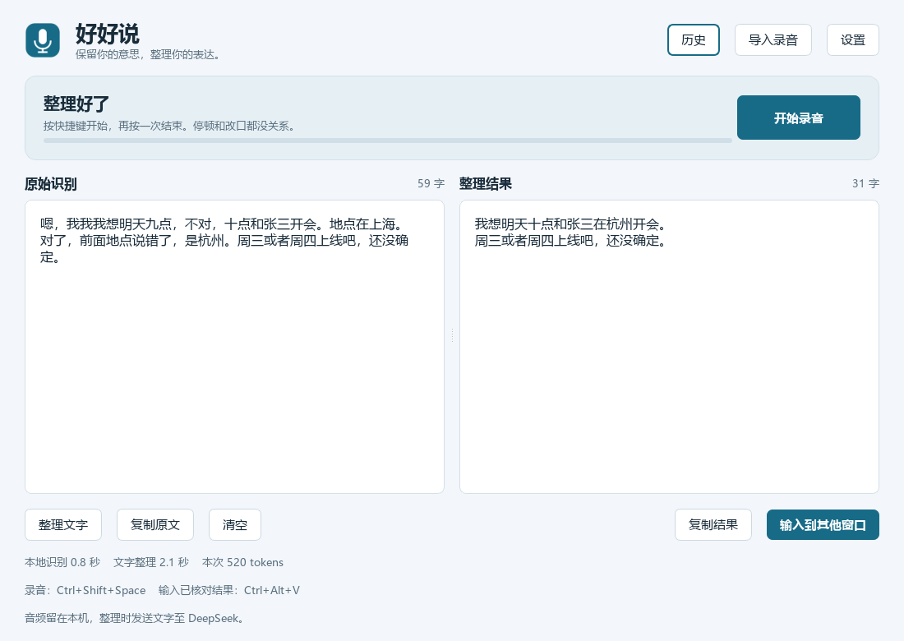

# Better Voice Input · 好好说

Windows 智能语音输入工具：本地识别声音，调用可配置的 AI API 清理结巴、无意义重复和明确的自我纠正，尽量保留原意与说话风格。



## 使用

在已构建的本机项目中双击 **启动好好说.cmd**，或运行 `dist/BetterVoiceInput/BetterVoiceInput.exe`。

- **按住 `Alt+X` 说话，松开后自动整理并输入到原来的光标处**，无需再次确认。
- 正常录音不弹出主窗口，只显示不抢焦点的小状态条；双击启动脚本后在系统托盘运行。
- `Esc`：取消当前任务。
- `Alt+V`：备用的手动补输，正常录音无需使用。
- 所有复制和输入统一为单行，支持终端直接输入，不自动按回车。
- 设置中填写 API 地址、API Key 和模型名称，支持兼容 Chat Completions 的服务。首次使用需下载约 240 MB 本地语音模型。
- 原文和结果可对照编辑；词库、可选加密历史、录音文件导入均已支持。
- 设置中可选择开机自启动，登录 Windows 后自动在托盘运行，默认关闭。

完整说明见 [使用指南](docs/USER_GUIDE.md)，实测情况和限制见 [验证记录](docs/VALIDATION.md)。

## 开发进度

- [x] 文字整理、语义保护与真实 API 验证
- [x] 本地语音识别、模型下载与示例录音验证
- [x] 桌面界面、录音、全局快捷键与输入
- [x] 集成测试、Windows 打包与使用说明

## 开发环境

需要 Windows 和 Python 3.12。模型和个人数据不进入 Git 仓库。

```powershell
python -m venv .venv
.\.venv\Scripts\python.exe -m pip install -e ".[dev]"
.\.venv\Scripts\python.exe -m pytest
.\.venv\Scripts\python.exe -m better_voice_input.app
```

精确依赖版本保存在 `requirements-lock.txt`。运行 `scripts/build.ps1` 可重新构建便携程序。仓库保存源码和构建方法，模型、密钥、用户录音和本地打包产物不进入 Git。

API 地址支持 Base URL（如 `https://api.example.com/v1`）或完整 `/chat/completions` 地址；模型名称使用服务商提供的 ID。现有 DeepSeek 配置继续兼容，它只是默认值。密钥按 API 地址分别保存在 Windows 凭据管理器，切换地址时需要该服务的密钥。

开发测试可将 `BVI_API_KEY` 与匹配的 `BVI_API_BASE_URL` 环境变量一起使用。旧 `DEEPSEEK_API_KEY` 和根目录 `deepseek api key.txt` 仅供 DeepSeek 官方接口使用。密钥和私有文件不会进入 Git。

## 原则

- 音频在本机识别；转写文本和相关词库发送至设置中选定的 API。
- 清理表达，不回答口述问题、不执行口述命令。
- 快捷键录音直接输入整理结果，疑点不阻断；API 整理失败时输入识别原文。原文和结果可在主窗口查看。
- 录音由用户主动开始和结束，停顿不自动提交。
- 只输入文字，不自动按回车发送。
- 录音仅在内存中，本地识别后释放；默认不保存文字历史，开启后最多保留最近 5 条（最长 7 天）。

实现规划见 [docs/PLAN.md](docs/PLAN.md)。
